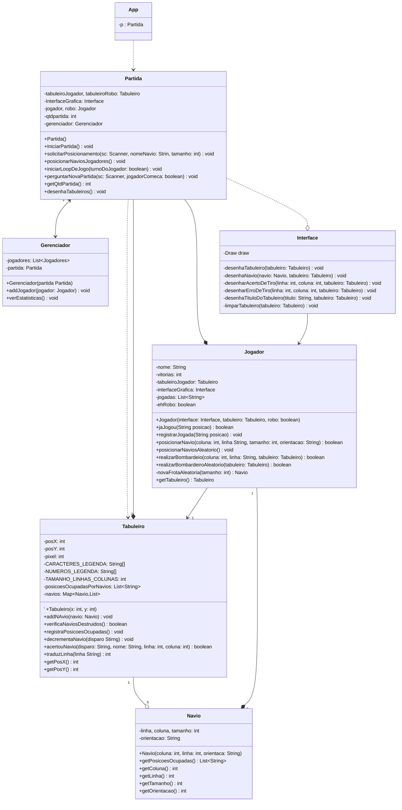

# Engenharia de Telecomunicações - Programação Orientada a Objetos
## Bernardo Souza Muniz - Projeto 1

### Como usar o repositório
Para clonar o repositório para a sua máquina local utilizando Git, basta executar o seguinte comando no seu terminal:

`git clone https://github.com/sergio-prolo-class/projeto-1-BernardoMuniz39`

### Sobre
Este repositório tem o objetivo de apresentar a resolução do projeto 1 da disciplina de Programação orientada a objetos. Durante a realização do projeto, foi utilizada a biblioteca **algs4** para desenhar os tabuleiros em questão.

Para utilizar o projeto, certifique-se de estar dentro da pasta clonada e com o gradle instalado no seu computador. Digite o seguinte comando no terminal da sua máquina local:

`gradle run` ou `./gradlew run`

## Diagrama UML
O diagrama UML tem o objetivo de demonstrar a associação entre cada classe no jogo da Batalha Naval. Abaixo está uma exemplificação do diagrama:

## Batalha Naval
Batalha Naval é um jogo de tabuleiro para dois jogadores.
Cada jogador possui uma frota de 5 navios com tamanhos
diferentes, como apresentados na Tabela 1. Esses navios
devem ser posicionados em uma grade de 10x10, sem
sobreposição e sem ultrapassar os limites do tabuleiro. O
jogo é jogado em turnos. A cada rodada, um jogador realiza
um disparo em uma posição da grade adversária ainda não
atingida. O oponente informa se o tiro foi um acerto ou um
erro. Se foi um acerto, o oponente também informa se o
navio foi afundado. A vez então passa para o outro jogador.
O jogo termina quando todos os navios de um jogador forem
afundados, e o outro é declarado vencedor.

A tabela abaixo mostra os navios presentes no jogo Batalha Naval, bem como a quantidade e identificação de cada um:

| Navio              | Tamanho (casas) | Símbolo |
|:------------------:|:---------------:|:-------:|
| Porta-aviões       |        5        |    P    |
| Encouraçado        |        4        |    E    |
| Cruzador           |        3        |    C    |
| Submarino          |        3        |    S    |
| Contratorpedeiro   |        2        |    N    |

### Posicionar navios
Ao iniciar o jogo você pode escolher entre posicionar seus navios automaticamente ou manualmente.
Se caso escolher automaticamente, o jogo gera um tabuleiro com novos navios posicionados de maneira aleatória e da início ao jogo.
Se caso optar por posicionar os navios de maneira manual, você pode escolher onde deseja posicionar cada navios presente na batalha naval.

Foi utilizado uma convenção onde ao digitar uma posição para ser alocado um navio, você estaria escolhendo aonde ficaria a ponta do navio e as outras demais posições seriam compostas pelo tamanho do navio

Ao posicionar um navio manualmente, você poderá escolher entre duas orientações, sendo elas:
- Horizontal: posiciona navios sempre a direita na horizontal
- Vertical: posiciona navios sempre para cima na vertical

Tal convenção foi utilizada para facilitar o posicionamento de cada navio.

Além disso, para posicionar um navio você deve informar uma coordenada válida no formato **"(linha) (coluna)"**, onde a linha seriam os valores que variam de A - J e a coluna de 0 - 9. Uma posição válida seria `A 5`, por exemplo.

### Realizar disparos
Após ter feito o posicionamento dos navios, será dado inicio ao jogo da batalha naval, onde será realizado tiros no tabuleiro inimigo, que neste caso será contra o computador.

Abaixo fica fica um registro da interação do jogo.

  

O tabuleiro com título "Navios" representa o seu tabuleiro, enquanto o tabuleiro com o título "Alvos" seria o tabuleiro do robô, aonde seria dado os disparos de maneira arbitraria com o intuito de acabar com todos os navios do jogo.

Semelhante ao posicionamento do navio, para atirar no tabuleiro inimigo você deve informar uma posição válida formato **"(linha) (coluna)"**, onde a linha seriam os valores que variam de A - J e a coluna de 0 - 9.

- Se caso o jogador ou o robô acertar algum navio inimigo, ele disparará um novo tiro até errar, e então a jogada passa para o outro jogador
- Ao final da partida você irá ver as estatísticas do jogo, contendo o jogador e o número de vitórias.

Fique a vontade para se divertir no jogo Batalha Naval!
