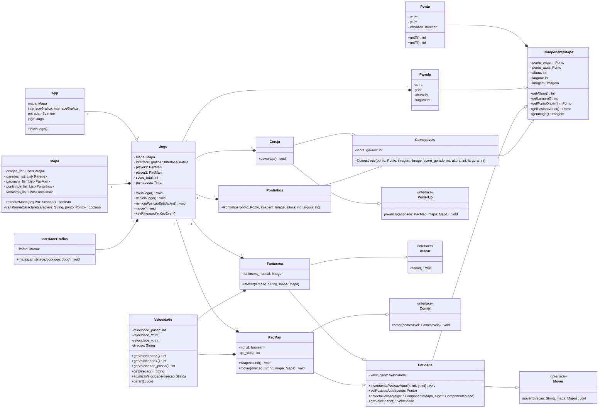

# Engenharia de Telecomunicações - Programação Orientada a Objetos
## Bernardo Souza Muniz e Ygor Vinícius Martins - Lista de exercícios 3

### Como usar o repositório
Para clonar o repositório para a sua máquina local utilizando Git, basta executar o seguinte comando no seu terminal:

`https://github.com/sergio-prolo-class/projeto-2-bernardomuniz-ygormartins`

### Sobre
Este repositório tem o objetivo de apresentar a resolução do projeto 2 disciplina de Programação orientada a objetos. 

Para utilizar o projeto, certifique-se de estar dentro da pasta do projeto e com o gradle instalado no seu computador. Digite o seguinte comando no terminal da sua máquina local:

`gradlew run`

Caso queira utilizar o modo cooperativo, digite este comando ao executar o projeto. O modo cooperativo permite a utilização de um segundo jogador controlado pelo mesmo teclado:

`gradlew run -args="coop"`

Se divirta jogando Pac-Man!

#### Diagrama UML:
